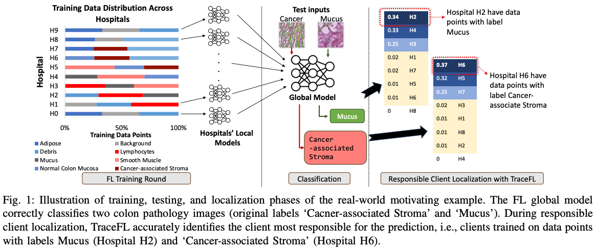

# TraceFL: Interpretability-Driven Debugging in Federated Learning via Neuron Provenance

[](https://colab.research.google.com/github/SEED-VT/TraceFL/blob/main/artifact.ipynb)
[](LICENSE)


**Paper:** [arXiv Preprint](https://arxiv.org/abs/2312.13632)  
**Artifact Archive:** [Figshare Permanent Record](https://doi.org/10.6084/m9.figshare.28293218)  
**Authors:** [Waris Gill](https://people.cs.vt.edu/waris/), [Ali Anwar](https://chalianwar.github.io/), [Muhammad Ali Gulzar](https://people.cs.vt.edu/~gulzar/)

> [!NOTE] 
> TraceFL is accepted at ICSE 2025. TraceFL artifact is fully functional and runs in less than 15 minutes on Google Colab with a single click. Read the full README for more details.

## 1. Purpose
**TraceFL** is the first **interpretability technique** that enables interpretability in Federated Learning (FL) by identifying clients responsible for specific global model predictions. By making such provenance information explicit, developers can **exclude** problematic clients, **reward** high-quality clients, or **debug** misclassifications more systematically.




**This artifact provides:**

-  Complete implementation of the TraceFL framework
-  Pre-configured experiments replicating all paper results
-  Cross-domain support for image/text classification models (e.g., GPT )
- **One-click reproducibility on Google Colab.** [](https://colab.research.google.com/github/SEED-VT/TraceFL/blob/main/artifact.ipynb)


**Badges Claimed**:

- **Artifacts Available**: All our code and documentation are publicly and permanently archived ([Figshare DOI](https://doi.org/10.6084/m9.figshare.28293218)).
- **Artifacts Functional**: We include step-by-step installation scripts, test commands, and evidence of correct behavior in a minimal environment.
- **Artifacts Reusable**: We offer detailed documentation, consistent structure, modular design, a permissive license, and instructions for extending the framework to new models/datasets.


## 2. Provenance

- **Paper Preprint:** [ICSE 2025 Camera-Ready](https://arxiv.org/pdf/2312.13632) 
- **Archived Artifact**: The exact version of this repository (including code, configurations, and instructions) is archived at **[Figshare DOI](https://doi.org/10.6084/m9.figshare.28293218)**.
- **GitHub Repository** (development version): [GitHub - SEED-VT/TraceFL](https://github.com/SEED-VT/TraceFL) (non-archival).  
- **License:** [](LICENSE)


## 3. Data

TraceFL is a **domain-agnostic** framework carefully designed to handle various data modalities (vision, text, and medical). We demonstrate its flexibility by evaluating multiple **image**, **medical imaging**, and **text** datasets, as well as different **neural architectures** ranging from classic **CNNs** to **transformers**.

### Datasets
   - **Image Classification**: *CIFAR-10, MNIST* (public benchmarks with 10 classes each).  
   - **Medical Imaging**: *Colon PathMNIST* and *Abdominal OrganAMNIST* from [MedMNIST](https://medmnist.com/). These datasets are curated, de-identified, and suitable for research in FL-based medical imaging.  
   - **Text Classification**: *DBpedia, Yahoo Answers* (both standard benchmarks in natural language processing).

   All datasets are publicly available. We follow [FlowerDatasets](https://flower.ai/docs/datasets/index.html) guidelines to download, partition, and integrate these datasets with minimal configuration overhead. 

### Models  
   - **Image Classification Models**: 
     - *ResNet* (e.g., `resnet18`, `resnet50`)  
     - *DenseNet* (e.g., `densenet121`)  
   - **Medical Imaging**: Same CNN-based architectures (ResNet, DenseNet) easily adapted for grayscale inputs or domain-specific classification tasks.  
   - **Text Classification Models**:
     - *GPT*  
     - *BERT*  
   
   TraceFL uses a consistent interpretability mechanism at the **neuron** level, which naturally extends to different layers and architectures. This ensures minimal or no code changes are needed to debug new classification models—so long as they output logits for classification.


## 4. Setup

**System Requirements**:
> [!NOTE] 
> **Original Paper Hardware Setup**: To resemble real-world FL and do large scale simulations, we deploy our experiments in [Flower FL framework](https://flower.ai/), running on an enterprise-level cluster of six NVIDIA DGX A100 nodes. Each node is equipped with 2048 GB of memory, at least 128 cores, and an A100 GPU with 80 GB of memory.

**Artifact Hardware Setup**: We change the default configuration in [tracefl/conf/base.yaml](tracefl/conf/base.yaml) to run representative experiments on Google Colab even with only 2 cpu cores, 12 GB of System RAM and 15 GB of GPU RAM. 


We provide **two** approaches to setting up the environment:

### 4.1 Quick Colab Setup 

To quickly validate and and produce the artifact, click: [](https://colab.research.google.com/github/SEED-VT/TraceFL/blob/main/artifact.ipynb). 

This will open a Google Colab notebook with all dependencies pre-installed. You can run the provided demo script to verify the installation and generate a sample provenance report.


### 4.2 Local/Conda Setup

1. **Create Conda environment** (Python 3.10):
   ```bash
   conda create --name tracefl python=3.10 -y
   conda activate tracefl
   ```
2. **Install Poetry**:
   ```bash
   pip install poetry
   ```
3. **Clone and install dependencies**:
   ```bash
   git clone https://github.com/SEED-VT/TraceFL
   cd TraceFL
   poetry install
   ```
   **Expected Output ✅:**  
   ```bash
        ...
        - Installing ruff (0.0.272)
        - Installing transformers (4.48.1)
        - Installing types-requests (2.27.7)
    
    Installing the current project: tracefl (1.0.0)
    ```

<!-- ### 4.3 Quick Docker Setup (Recommended)

We offer a Docker image for consistent, frictionless installation:
```bash
# 1. Clone this repository
git clone https://github.com/SEED-VT/TraceFL
cd TraceFL

# 2. Build the Docker image
docker build -t tracefl:latest .

# 3. Run the container (maps a local port if needed)
docker run -it --gpus all --name tracefl_container tracefl:latest
```
Inside the container, you can run all commands exactly as described below. -->


## 5. Usage

### 5.1 Fully Functional TraceFL Artifact Command

We configure TraceFL using a YAML file ([tracefl/conf/base.yaml](tracefl/conf/base.yaml)) or command-line arguments. Any parameter in the YAML file can be overridden by passing a flag to the `python -m tracefl.main` command (e.g., `dirichlet_alpha=0.1`). By only using this command and the YAML file, you can run all experiments in the paper. However, we provide additional scripts for specific figures/tables for convenience.

```bash
# Run TraceFL with default configuration (base.yaml) or override. 
python -m tracefl.main dirichlet_alpha=0.1 
```
**Expected Outcome**:  
- The script trains a small FL setup with 2 clients on MNIST for 1 round.  
- If successful, the console logs will indicate completion with a message like:  
```bash
...
[INFO] -             *********** Input Label: 8, Responsible Client(s): c1  *************
[INFO] -      Traced Client: c1 || Tracing = Correct
[INFO] -     TraceFL Clients Contributions Rank:     {'c1': 0.98, 'c16': 0.01, 'c19': 0.01, 'c9': 0.01}
[INFO] - 

[INFO] - [Round 3] TraceFL Localization Accuracy = 100.0 || Total Inputs Used In Prov: 6 || GM_(loss, acc) (3.24006986618042,0.18896484375)
[INFO] - ----------------------------
[INFO] - Total Rounds: 3
[INFO] - TraceFL Average Localization Accuracy: 100.0
```
This will also generate a provenance report [TraceFL_clients_contributions.log](TraceFL_clients_contributions.log) in the current directory. Inspect the file for detailed neuron contributions and responsible clients for each input label.


### 5.2 Reproducing Main Paper Experiments

> [!NOTE]
> - These scripts are also **executable in Colab** [](https://colab.research.google.com/github/SEED-VT/TraceFL/blob/main/artifact.ipynb).  
> - Simply open the Colab notebook, **uncomment the relevant evaluation cell**, and run.  
> - They are configured with minimal resource requirements for standard hardware.  
> - To run large-scale experiments (as in the paper, on a DGX A100 cluster), **adjust your hardware settings** and **increase the number of clients/rounds** in the config.

Although any configuration can be run via the command-line, e.g.,:
```bash
python -m tracefl.main dirichlet_alpha=0.1
```
we provide **scripts** that reproduce each figure/table result from the paper. All generated logs are stored in [TraceFL_clients_contributions.log](TraceFL_clients_contributions.log).

1. **TraceFL’s Localization Accuracy in Correct Predictions (Figure-2), TraceFL’s Scalability (Table-3 and Figure-5)** 
    ```bash
    bash scripts/a_figure_2_table_3_and_figure_5.sh
    ```
    
2. **Varying Data Distribution Figure-3**
   ```bash
   bash scripts/b_figure_3.sh
   ```
   

3. **TraceFL’s Localization Accuracy in Mispredictions (Table-1) and (Figure-6)** 
   ```bash
   bash scripts/c_table_1_and_figure_6.sh
   ```

4. **Differential Privacy (DP) Enabled FL (Figure-4 and Table-2)**
   ```bash
   bash scripts/d_figure_4_and_table_2.sh
   ```


### 5.3 Beyond Replication: Customizing TraceFL

**TraceFL** is easily extensible to new datasets, models, and configurations. For example, the [Hugging Face](https://huggingface.co) library offers approximately 80k text classification models, 15k image classification models, 5k text classification datasets, and 1k image classification datasets. TraceFL can adapt to these with minimal changes (10–15 lines of code).

To demonstrate, we integrate the [distilbert/distilbert-base-uncased](https://huggingface.co/distilbert/distilbert-base-uncased) model  which is not included in the paper and  the `dbpedia_14` dataset,

```bash
python -m tracefl.main dataset.name=dbpedia_14  model.name=distilbert/distilbert-base-uncased device=cuda

```

## 6 License
This artifact is released under [](LICENSE), enabling:
- Commercial use
- Modification
- Distribution
- Private use


## 7. How This Artifact Meets ICSE Criteria

1. **Available**  
   - Permanently hosted on Figshare ([Figshare DOI](https://doi.org/10.6084/m9.figshare.28293218)) and supplemented on GitHub.  

2. **Functional**  
   - Documented installation procedures.  
   - Includes a one-click Google Colab setup for quick validation.  
   - Reproduces major results from the paper via the provided scripts.  

3. **Reusable**  
   - Carefully organized code (modular architecture, YAML configuration).  
   - Extension for new datasets or neural architectures.  
   - A permissive, open-source license ensures freedom to reuse.  
   -  Fully functional minimal Google Colab setup (better than docker) and fully functional local setup to can run on industrial scale HPC clusters to do real world FL simulations.   

## 8. Contact and Support
- For any installation or usage issues, please open a GitHub Issue at [TraceFL Issues](https://github.com/SEED-VT/TraceFL/issues).  
- For questions related to the paper or advanced usage, contact the author directly via (waris@vt.edu)[waris@vt.edu]. 


### Award Considerations
- **First-of-its-kind:** TraceFL is the first FL interpretability framework to identify clients responsible for global model predictions and addresses the open challenge of interpretability in FL.
- **Cross-Domain Validation:** Works with 4 model architectures across 6 datasets including real-world medical imaging datasets including modern architectures like GPT.  
- **Scalability:** From Colab-free tier to multi-GPU clusters.
- **Reproducibility:** Each evaluation in a figure or table in the paper can be replicated with a single script.
- **Impact:** First FL interpretability framework supporting both CV/NLP.
- **Innovation:** Implements novel neuron provenance tracking methodology.

### Citation
If you use TraceFL in your research, please cite our paper:
```bibtex
@inproceedings{gill2025tracefl,
  title = {{TraceFL: Interpretability-Driven Debugging in Federated Learning via Neuron Provenance}},
  author = {Gill, Waris and Anwar, Ali and Gulzar, Muhammad Ali},
  booktitle = {2025 IEEE/ACM 47th International Conference on Software Engineering (ICSE)},
  year = {2025},
  organization = {IEEE},
}
```